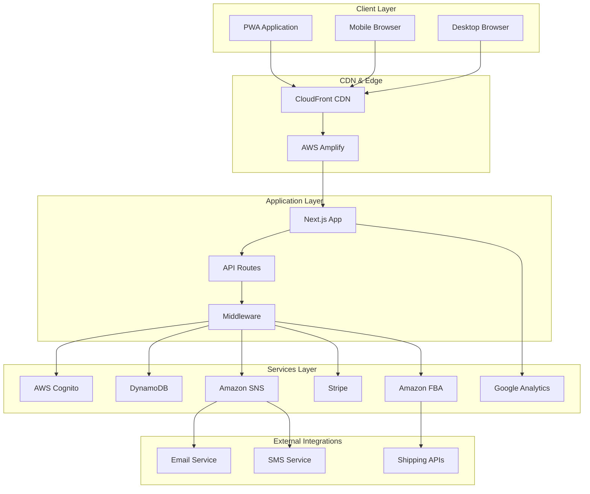
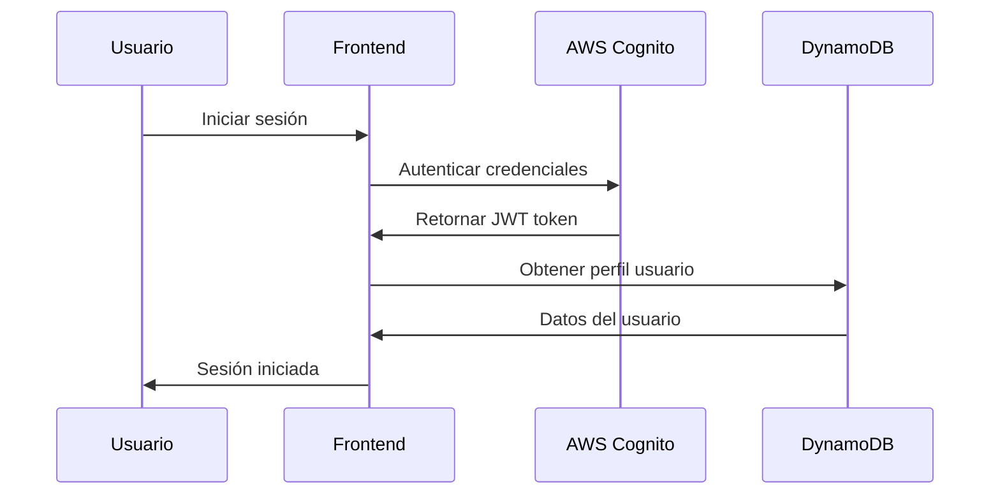
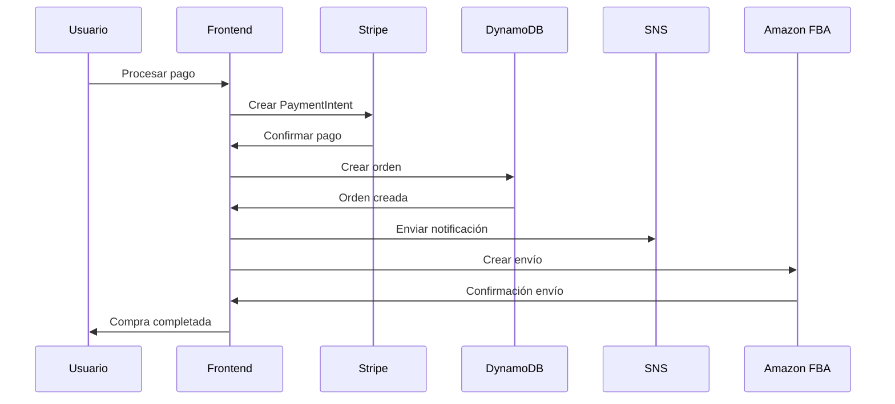
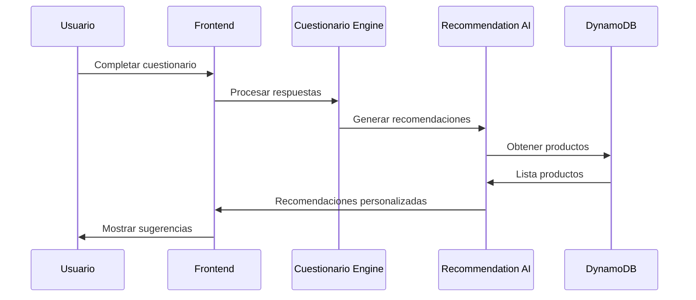

# 🏗️ Arquitectura del Sistema - Wellness Supplements Platform

## 📋 Índice

1. [Visión General](#visión-general)
2. [Stack Tecnológico](#stack-tecnológico)
3. [Arquitectura de Alto Nivel](#arquitectura-de-alto-nivel)
4. [Estructura del Proyecto](#estructura-del-proyecto)
5. [Patrones de Diseño](#patrones-de-diseño)
6. [Flujo de Datos](#flujo-de-datos)
7. [Seguridad](#seguridad)
8. [Performance](#performance)
9. [Escalabilidad](#escalabilidad)
10. [Monitoring](#monitoring)

## 🎯 Visión General

La **Wellness Supplements Platform** es una aplicación web moderna de comercio electrónico especializada en suplementos dietéticos. Actúa como un "asesor digital de bienestar" proporcionando recomendaciones personalizadas basadas en cuestionarios dinámicos y seguimiento inteligente del consumo.

### Características Principales

- 🔐 **Autenticación robusta** con AWS Cognito + 2FA
- 🛒 **E-commerce completo** con Stripe integration
- 📊 **Cuestionarios dinámicos** para recomendaciones personalizadas
- 📈 **Seguimiento de consumo** con alertas automáticas
- 🎯 **Panel de administración** completo
- 📱 **PWA-ready** con soporte offline
- 🚀 **Serverless architecture** en AWS

## 🛠️ Stack Tecnológico

### Frontend
```typescript
- Next.js 15 (App Router)
- React 18
- TypeScript
- Tailwind CSS
- Framer Motion
- React Hook Form
- Stripe Elements
```

### Backend & APIs
```typescript
- Next.js API Routes
- AWS Cognito (Authentication)
- Amazon DynamoDB (Database)
- Amazon SNS (Notifications)
- Amazon FBA API (Logistics)
- Stripe API (Payments)
```

### DevOps & Deployment
```yaml
- AWS Amplify (Hosting)
- GitHub Actions (CI/CD)
- Google Analytics 4 (Analytics)
- Lighthouse (Performance)
- Jest + Testing Library (Testing)
```

## 🏛️ Arquitectura de Alto Nivel



## 📁 Estructura del Proyecto

```
wellness-supplements-platform/
├── 📁 src/
│   ├── 📁 app/                    # App Router (Next.js 15)
│   │   ├── 📁 admin/             # Panel administración
│   │   ├── 📁 api/               # API Routes
│   │   ├── 📁 checkout/          # Proceso de compra
│   │   ├── 📁 productos/         # Catálogo productos
│   │   ├── 📁 cuestionario/      # Cuestionario dinámico
│   │   ├── 📁 seguimiento/       # Tracking consumo
│   │   ├── layout.tsx            # Layout principal
│   │   ├── page.tsx              # Página inicio
│   │   ├── globals.css           # Estilos globales
│   │   ├── sitemap.ts            # SEO sitemap
│   │   ├── robots.ts             # SEO robots
│   │   └── manifest.ts           # PWA manifest
│   ├── 📁 components/            # Componentes React
│   │   ├── 📁 admin/            # Componentes admin
│   │   ├── 📁 auth/             # Autenticación UI
│   │   ├── 📁 cart/             # Carrito compras
│   │   ├── 📁 checkout/         # Proceso pago
│   │   ├── 📁 products/         # Catálogo UI
│   │   ├── 📁 questionnaire/    # Cuestionario UI
│   │   ├── 📁 shared/           # Componentes comunes
│   │   └── 📁 tracking/         # Seguimiento UI
│   ├── 📁 hooks/                # Custom React Hooks
│   │   ├── useAuth.tsx          # Hook autenticación
│   │   ├── useCart.tsx          # Hook carrito
│   │   └── useConsumption.tsx   # Hook seguimiento
│   ├── 📁 lib/                  # Servicios y utilidades
│   │   ├── analytics.ts         # Google Analytics
│   │   ├── auth.ts              # Servicio auth
│   │   ├── dynamodb.ts          # DynamoDB service
│   │   ├── fba-integration.ts   # Amazon FBA
│   │   ├── notifications.ts     # SNS notifications
│   │   ├── security.ts          # Seguridad
│   │   ├── seo.ts               # SEO utilities
│   │   └── stripe.ts            # Stripe service
│   ├── 📁 types/                # TypeScript definitions
│   │   └── index.ts             # Tipos principales
│   └── middleware.ts            # Next.js middleware
├── 📁 __tests__/               # Tests automatizados
├── 📁 scripts/                 # Scripts utilidades
├── 📁 .github/workflows/       # CI/CD pipelines
├── 📁 public/                  # Assets estáticos
├── 📄 package.json             # Dependencias
├── 📄 next.config.js           # Configuración Next.js
├── 📄 tailwind.config.js       # Configuración Tailwind
├── 📄 amplify.yml              # Configuración Amplify
└── 📄 README.md                # Documentación
```

## 🎨 Patrones de Diseño

### 1. **Component Composition Pattern**
```typescript
// Ejemplo: Composición de componentes para productos
<ProductCard>
  <ProductImage />
  <ProductInfo>
    <ProductTitle />
    <ProductPrice />
    <ProductRating />
  </ProductInfo>
  <ProductActions>
    <AddToCartButton />
    <FavoriteButton />
  </ProductActions>
</ProductCard>
```

### 2. **Custom Hooks Pattern**
```typescript
// Hook personalizado para gestión de estado
const useAuth = () => {
  const [user, setUser] = useState(null)
  const [loading, setLoading] = useState(true)
  
  const signIn = async (credentials) => { /* ... */ }
  const signOut = async () => { /* ... */ }
  
  return { user, loading, signIn, signOut }
}
```

### 3. **Service Layer Pattern**
```typescript
// Capa de servicios para lógica de negocio
class DynamoDBService {
  static async createUser(user: User): Promise<User> { /* ... */ }
  static async getUserById(id: string): Promise<User | null> { /* ... */ }
  static async updateUser(id: string, updates: Partial<User>): Promise<User> { /* ... */ }
}
```

### 4. **Provider Pattern**
```typescript
// Context providers para estado global
<AuthProvider>
  <CartProvider>
    <ConsumptionProvider>
      <App />
    </ConsumptionProvider>
  </CartProvider>
</AuthProvider>
```

### 5. **Middleware Pattern**
```typescript
// Middleware para autenticación y seguridad
export function middleware(request: NextRequest) {
  // Rate limiting
  // Authentication
  // Security headers
  // Request validation
}
```

## 🔄 Flujo de Datos

### 1. **Autenticación Flow**


### 2. **Flujo de Compra**


### 3. **Flujo de Recomendaciones**


## 🔒 Seguridad

### 1. **Autenticación y Autorización**
- **AWS Cognito** para gestión de usuarios
- **JWT tokens** con expiración automática
- **2FA (TOTP)** para cuentas sensibles
- **Role-based access control** (RBAC)

### 2. **Seguridad de Red**
- **HTTPS obligatorio** con HSTS
- **CSP headers** para prevenir XSS
- **CORS configuration** restrictiva
- **Rate limiting** por IP y usuario

### 3. **Seguridad de Datos**
- **Cifrado en tránsito** (TLS 1.3)
- **Cifrado en reposo** (DynamoDB encryption)
- **Sanitización de inputs** automática
- **SQL injection prevention** (NoSQL)

### 4. **Security Headers**
```typescript
const securityHeaders = {
  'X-Frame-Options': 'DENY',
  'X-XSS-Protection': '1; mode=block',
  'X-Content-Type-Options': 'nosniff',
  'Referrer-Policy': 'origin-when-cross-origin',
  'Permissions-Policy': 'camera=(), microphone=(), geolocation=()',
  'Strict-Transport-Security': 'max-age=31536000; includeSubDomains; preload'
}
```

## ⚡ Performance

### 1. **Frontend Optimizations**
- **Code splitting** automático por rutas
- **Image optimization** con Next.js Image
- **Font optimization** con Google Fonts
- **Bundle analysis** y tree shaking
- **Critical CSS** inlining

### 2. **Caching Strategy**
```typescript
// Cache configuration
- Static assets: 1 year
- API responses: 5 minutes
- Dynamic pages: ISR (1 hour)
- CDN cache: Global edge locations
```

### 3. **Database Performance**
- **DynamoDB** con auto-scaling
- **GSI (Global Secondary Indexes)** para queries
- **Batch operations** para múltiples items
- **Connection pooling** optimizado

### 4. **Core Web Vitals**
- **LCP** < 2.5s (Largest Contentful Paint)
- **FID** < 100ms (First Input Delay)
- **CLS** < 0.1 (Cumulative Layout Shift)

## 📈 Escalabilidad

### 1. **Horizontal Scaling**
- **Serverless architecture** con auto-scaling
- **CDN global** (CloudFront)
- **Load balancing** automático
- **Multi-region deployment** capability

### 2. **Database Scaling**
- **DynamoDB on-demand** scaling
- **Read replicas** para consultas
- **Partition key** optimization
- **TTL** para cleanup automático

### 3. **Microservices Architecture**
```typescript
Services:
- User Service (Authentication)
- Product Service (Catalog)
- Order Service (E-commerce)
- Notification Service (SNS)
- Analytics Service (GA4)
- Payment Service (Stripe)
```

## 📊 Monitoring

### 1. **Application Monitoring**
- **Google Analytics 4** para user behavior
- **Custom events** para business metrics
- **Performance monitoring** con Lighthouse
- **Error tracking** con console logs

### 2. **Infrastructure Monitoring**
- **AWS CloudWatch** para metrics
- **Health checks** endpoints
- **Uptime monitoring** external
- **Log aggregation** CloudWatch Logs

### 3. **Security Monitoring**
- **Failed login attempts** tracking
- **Suspicious activity** detection
- **IP blocking** automático
- **Security events** logging

### 4. **Business Metrics**
```typescript
Key Metrics:
- Conversion rate
- Average order value
- User retention
- Cart abandonment rate
- Customer acquisition cost
- Product recommendation accuracy
```

## 🔧 Development Workflow

### 1. **Git Flow**
```
main (production)
├── develop (staging)
├── feature/nueva-funcionalidad
├── hotfix/bug-critico
└── release/v1.2.0
```

### 2. **CI/CD Pipeline**
```yaml
Stages:
1. Code Quality (Lint, Type check)
2. Testing (Unit, Integration)
3. Security Scan (Dependencies, SAST)
4. Build & Deploy (Staging)
5. E2E Testing (Automated)
6. Deploy Production (Manual approval)
7. Health Checks (Automated)
```

### 3. **Environment Strategy**
- **Development**: Local development
- **Staging**: Pre-production testing
- **Production**: Live environment

## 🚀 Deployment Architecture

### AWS Amplify Deployment
```mermaid
graph LR
    subgraph "Source Control"
        GH[GitHub Repository]
    end
    
    subgraph "CI/CD"
        GA[GitHub Actions]
        AMP[AWS Amplify]
    end
    
    subgraph "Production"
        CF[CloudFront CDN]
        S3[S3 Bucket]
        LAMBDA[Lambda@Edge]
    end
    
    GH --> GA
    GA --> AMP
    AMP --> CF
    CF --> S3
    CF --> LAMBDA
```

---

## 📚 Referencias Técnicas

- [Next.js 15 Documentation](https://nextjs.org/docs)
- [AWS Amplify Guide](https://docs.amplify.aws/)
- [DynamoDB Best Practices](https://docs.aws.amazon.com/dynamodb/latest/developerguide/best-practices.html)
- [Stripe Integration Guide](https://stripe.com/docs)
- [Google Analytics 4](https://developers.google.com/analytics/devguides/collection/ga4)

---

**📝 Documento mantenido por el equipo de desarrollo**  
**🔄 Última actualización: $(date)**