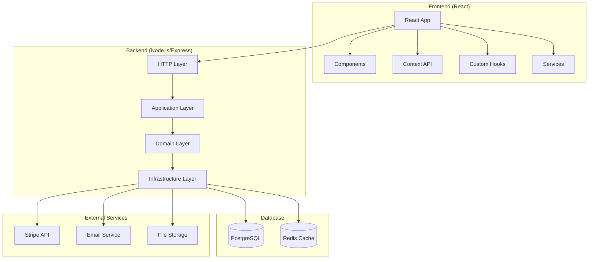
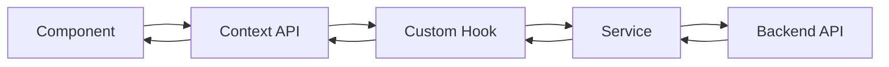

# Arquitectura de Vitality Store

## Resumen

Vitality Store utiliza una **arquitectura monolítica modular** que separa claramente el frontend y backend, manteniendo una estructura bien organizada y escalable.

## Visión General de la Arquitectura



## Tecnologías Clave

### Frontend
- **Framework**: React 18
- **Routing**: React Router DOM 6
- **Estado**: Context API
- **Estilos**: Tailwind CSS 3
- **HTTP Client**: Axios
- **Build Tool**: Create React App

### Backend
- **Runtime**: Node.js 18+
- **Framework**: Express.js
- **Arquitectura**: Domain-Driven Design (DDD)
- **Autenticación**: JWT + bcrypt
- **Validación**: Joi
- **Logging**: Morgan

### Base de Datos
- **Principal**: PostgreSQL 15
- **Cache**: Redis 7
- **Migraciones**: SQL scripts
- **Seeds**: SQL data scripts

### DevOps
- **Contenedores**: Docker & Docker Compose
- **CI/CD**: GitHub Actions
- **Testing**: Jest
- **Linting**: ESLint

## Estructura del Proyecto

### Frontend (/frontend)

```
frontend/
├── src/
│   ├── components/          # Componentes React organizados por funcionalidad
│   │   ├── common/         # Componentes comunes
│   │   ├── product/        # Componentes de productos
│   │   ├── cart/           # Componentes del carrito
│   │   ├── checkout/       # Componentes del checkout
│   │   ├── user/           # Componentes del usuario
│   │   └── admin/          # Componentes de administración
│   │
│   ├── pages/              # Páginas principales de la aplicación
│   ├── hooks/              # Custom hooks para lógica reutilizable
│   ├── context/            # Context providers para estado global
│   ├── services/           # Servicios para comunicación con API
│   ├── utils/              # Utilidades y helpers
│   └── styles/             # Estilos globales y configuración
│
├── public/                 # Assets estáticos
└── tests/                  # Tests del frontend
```

### Backend (/backend)

```
backend/
├── src/
│   ├── domain/             # Capa de Dominio (DDD)
│   │   ├── entities/       # Entidades del negocio
│   │   ├── repositories/   # Interfaces de repositorios
│   │   ├── services/       # Servicios de dominio
│   │   └── valueObjects/   # Objetos de valor
│   │
│   ├── application/        # Capa de Aplicación (DDD)
│   │   ├── use-cases/      # Casos de uso organizados por módulo
│   │   └── dto/            # Data Transfer Objects
│   │
│   ├── infrastructure/     # Capa de Infraestructura (DDD)
│   │   ├── database/       # Configuración y conexión DB
│   │   ├── repositories/   # Implementaciones de repositorios
│   │   ├── http/           # Controladores, rutas, middleware
│   │   ├── services/       # Servicios externos
│   │   └── config/         # Configuraciones
│   │
│   └── main.js             # Punto de entrada de la aplicación
│
└── tests/                  # Tests organizados por tipo
    ├── unit/               # Tests unitarios
    ├── integration/        # Tests de integración
    └── e2e/                # Tests end-to-end
```

## Principios de Diseño

### 1. Separación de Responsabilidades

**Frontend**: Se enfoca únicamente en la presentación y experiencia de usuario.
**Backend**: Maneja la lógica de negocio, validación y persistencia de datos.

### 2. Domain-Driven Design (DDD)

El backend implementa DDD con tres capas principales:

- **Domain**: Lógica de negocio pura, entities y value objects
- **Application**: Casos de uso y orquestación de la lógica de dominio
- **Infrastructure**: Detalles técnicos (DB, APIs externas, etc.)

### 3. Inversión de Dependencias

Las capas internas no dependen de las externas. Los repositorios son interfaces en el dominio e implementaciones en infraestructura.

### 4. Modularidad

Cada módulo tiene responsabilidades bien definidas y puede evolucionar independientemente.

## Flujo de Datos

### Request Flow (Frontend → Backend)

1. **User Action** → Component
2. **Component** → Custom Hook o Service
3. **Service** → HTTP Request (Axios)
4. **Backend Controller** → Use Case
5. **Use Case** → Domain Service/Repository
6. **Repository** → Database
7. **Response** ← Reverse flow

### State Management (Frontend)



## Patrones de Diseño

### 1. Repository Pattern
Abstrae el acceso a datos y permite cambiar la implementación sin afectar la lógica de negocio.

### 2. Use Case Pattern
Encapsula la lógica de aplicación específica para cada caso de uso.

### 3. Factory Pattern
Para la creación de entidades complejas.

### 4. Observer Pattern
Context API para notificar cambios de estado a componentes.

## Seguridad

### Autenticación
- JWT tokens con expiración
- Refresh tokens para renovación automática
- Hashing de contraseñas con bcrypt

### Autorización
- Middleware de autenticación en rutas protegidas
- Verificación de roles (customer, admin)
- Validación de permisos por endpoint

### Validación
- Joi para validación de entrada en backend
- Validación en frontend para mejor UX
- Sanitización de datos

### Headers de Seguridad
- Helmet.js para headers HTTP seguros
- CORS configurado específicamente
- Rate limiting

## Performance

### Frontend
- Code splitting automático
- Lazy loading de componentes
- Memoización con useMemo/useCallback
- Optimización de re-renders

### Backend
- Connection pooling en PostgreSQL
- Cache con Redis para datos frecuentes
- Compresión gzip
- Índices optimizados en base de datos

### Base de Datos
- Índices en campos de búsqueda frecuente
- Queries optimizadas
- Paginación para listados grandes

## Monitoreo y Observabilidad

### Logging
- Morgan para logs HTTP
- Structured logging para diferentes niveles
- Logs centralizados en producción

### Health Checks
- Endpoint `/api/health` para verificar estado
- Health checks de base de datos
- Monitoring de recursos

### Métricas
- Response times
- Error rates
- Resource usage

## Escalabilidad

### Horizontal Scaling
- Stateless backend permite múltiples instancias
- Load balancer con Nginx
- Session storage en Redis

### Vertical Scaling
- Optimización de queries
- Índices de base de datos
- Connection pooling

### Caching Strategy
- Redis para session storage
- Cache de consultas frecuentes
- CDN para assets estáticos

## Testing Strategy

### Frontend
- Unit tests: React Testing Library
- Integration tests: User interactions
- E2E tests: Cypress/Playwright

### Backend
- Unit tests: Domain logic
- Integration tests: API endpoints
- E2E tests: Complete workflows

### Cobertura Objetivo
- Mínimo 70% code coverage
- 100% coverage en lógica crítica de negocio

## Deployment

### Containerización
- Docker para desarrollo y producción
- Docker Compose para orquestación local
- Multi-stage builds para optimización

### CI/CD
- GitHub Actions para pipeline automatizado
- Tests automáticos en PR
- Deploy automático en merge

### Environments
- Development: Docker Compose local
- Staging: Environment de testing
- Production: Optimizado para performance

## Consideraciones Futuras

### Microservicios
La arquitectura actual permite migración gradual a microservicios:
- Separar módulos por bounded contexts
- API Gateway para routing
- Event sourcing para comunicación

### Mejoras de Performance
- GraphQL para optimizar queries
- Server-side rendering (SSR)
- Progressive Web App (PWA)

### Monitoreo Avanzado
- APM (Application Performance Monitoring)
- Distributed tracing
- Alerting automatizado